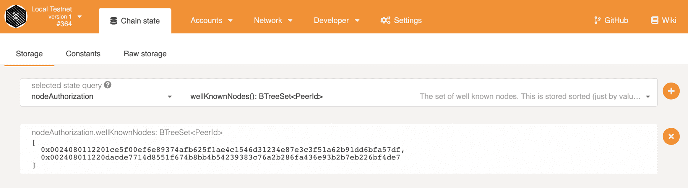
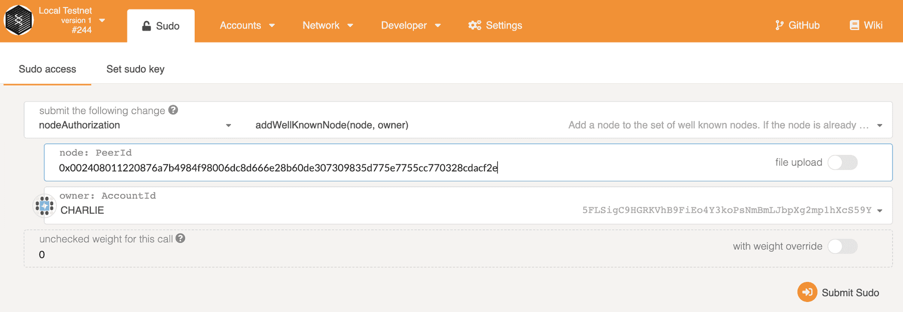
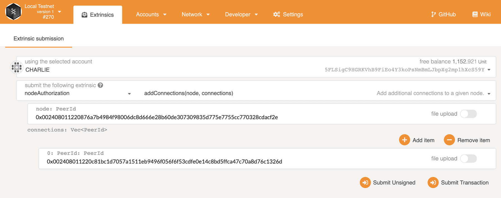
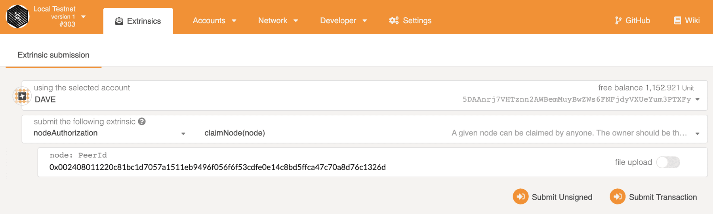
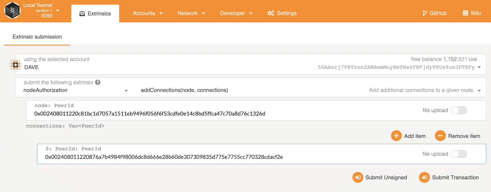
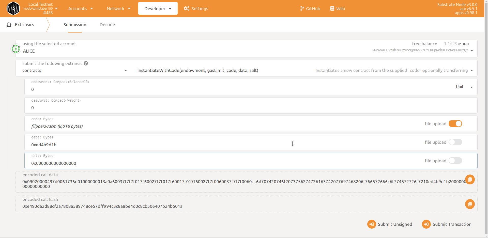

# About

RainyelLedger is a permissioned blockchain platform that is capable of execute smart 
contracts programmed with ink!. The request to the contract storage is made via RPC and authorization of administrators is necessary to join the network. Instantiation of the smart contracts on the network is only authorized to administrators. The node of Substrate was modified to create a permissioned node, the authorization node pallet was used to provide access to the network, the smart contract pallet was modified to provide feeless smart contract execution. RainyelLedger was created using [Substrate][1].

# Requirements

- cargo-chef v0.1.21
- Docker

# How to execute

Execute 

```sh 
docker build -f Dockerfile-debug -t rayniel95/rainyelledger:v0.1 ./
``` 

to create the docker image.

Execute 

```sh 
docker run --rm -it --network host rayniel95/rainyelledger:v0.1 ./node-template --tmp --dev
``` 

to run the node.

# Creating a test network

For this demonstration, we'll launch 4 nodes: 3 well known nodes that are allowed to author and validate blocks, and 1 sub-node that only has read-only access to data from a selected well-known node (upon it's approval).

## Obtaining Node Keys and PeerIDs

### For Alice's well known node:

```bash
# node key
c12b6d18942f5ee8528c8e2baf4e147b5c5c18710926ea492d09cbd9f6c9f82a

# peerid, generated from node key
12D3KooWBmAwcd4PJNJvfV89HwE48nwkRmAgo8Vy3uQEyNNHBox2

# bs58 decoded peer id in hex:
0024080112201ce5f00ef6e89374afb625f1ae4c1546d31234e87e3c3f51a62b91dd6bfa57df
```

### For Bob's well known node:

```bash
# node key
6ce3be907dbcabf20a9a5a60a712b4256a54196000a8ed4050d352bc113f8c58

# peer id, generated from node key
12D3KooWQYV9dGMFoRzNStwpXztXaBUjtPqi6aU76ZgUriHhKust

# bs58 decoded peer id in hex:
002408011220dacde7714d8551f674b8bb4b54239383c76a2b286fa436e93b2b7eb226bf4de7
```

### For Charlie's NOT well known node:

```bash
# node key
3a9d5b35b9fb4c42aafadeca046f6bf56107bd2579687f069b42646684b94d9e

# peer id, generated from node key
12D3KooWJvyP3VJYymTqG7eH4PM5rN4T2agk5cdNCfNymAqwqcvZ

# bs58 decoded peer id in hex:
002408011220876a7b4984f98006dc8d666e28b60de307309835d775e7755cc770328cdacf2e
```

### For Dave's sub-node (to Charlie, more below):

```bash
# node key
a99331ff4f0e0a0434a6263da0a5823ea3afcfffe590c9f3014e6cf620f2b19a

# peer id, generated from node key
12D3KooWPHWFrfaJzxPnqnAYAoRUyAHHKqACmEycGTVmeVhQYuZN

# bs58 decoded peer id in hex:
002408011220c81bc1d7057a1511eb9496f056f6f53cdfe0e14c8bd5ffca47c70a8d76c1326d
```

The nodes of Alice and Bob are already configured in genesis storage and serve as well known nodes. We will later add Charlie's node into the set of well known nodes. Finally we will add the connection between Charlie's node and Dave's node without making Dave's node as a well known node.

## Alice and Bob Start the Network

Let's start Alice's node first:

```bash
docker run --rm -it --network host rayniel95/rainyelledger:v0.1 ./node-template \
--chain=local \
--base-path /tmp/validator1 \
--alice \
--node-key=c12b6d18942f5ee8528c8e2baf4e147b5c5c18710926ea492d09cbd9f6c9f82a \
--port 30333 \
--ws-port 9944
```

Here we are using --node-key to specify the key that are used for the security connection of the network. This key is also used internally to generate the human readable PeerId as shown in above section.

Other used CLI flags are:

- `--chain=local` for a local testnet (not the same as the `--dev` flag!).
- `--alice` to make the node an authority which can author and finalize block, also give the node a name which is alice.
- `--port` assign a port for peer to peer connection.
- `--ws-port` assign a listening port for WebSocket connection.

Start Bob's node:

```bash
# In a new terminal, leave Alice running
docker run --rm -it --network host rayniel95/rainyelledger:v0.1 ./node-template \
--chain=local \
--base-path /tmp/validator2 \
--bob \
--node-key=6ce3be907dbcabf20a9a5a60a712b4256a54196000a8ed4050d352bc113f8c58 \
--port 30334 \
--ws-port 9945
```

After both nodes are started, you should be able to see new blocks authored and finalized in bother terminal logs. Now let's use the [polkadot.js][2] apps and check the well known nodes of our blockchain. Don't forget to switch to one of our local nodes running: 127.0.0.1:9944 or 127.0.0.1:9945.

Firstly, we need to add an extra setting to tell the frontend the type of the PeerId used in node-authorization pallet. Note: the format of PeerId here is a wrapper on bs58 decoded peer id in bytes. Go to the Settings Developer page in apps , add following custom type mapping information:

```bash
// add this as is, or with other required types you have set already:
{
  "PeerId": "(Vec<u8>)"
}
```

Then, let's go to Developer page, Chain State sub-tab, and check the data stored in the nodeAuthorization pallet, wellKnownNodes storage. You should be able to see the peer ids of Alice and Bob's nodes, prefixed with 0x to show its bytes in hex format.

We can also check the owner of one node by querying the storage owners with the peer id of the node as input, you should get the account address of the owner.



## Add Another Well Known Node

Let's start Charlie's node,

```bash
docker run --rm -it --network host rayniel95/rainyelledger:v0.1 ./node-template \
--chain=local \
--base-path /tmp/validator3 \
--name charlie  \
--node-key=3a9d5b35b9fb4c42aafadeca046f6bf56107bd2579687f069b42646684b94d9e \
--port 30335 \
--ws-port=9946 \
--offchain-worker always
```

After it was started, you should see there are no connected peers for this node. This is because we are trying to connect to a permissioned network, you need to get authorization to to be connectable! Alice and Bob were configured already in the genesis chain_spec.rs, where all others mut be added manually via extrinsic.

Remember that we are using sudo pallet for our governance, we can make a sudo call on add_well_known_node dispatch call provided by node-authorization pallet to add our node. You can find more avaliable calls in this reference doc.

Go to Developer page, Sudo tab, in apps and submit the nodeAuthorization - add_well_known_node call with the peer id in hex of Charlie's node and the owner is Charlie, of course. Note Allice is the valid sudo origin for this call.



After the transaction is included in the block, you should see Charlie's node is connected to Alice and Bob's nodes, and starts to sync blocks. Notice the reason the three nodes can find each other is mDNS discovery mechanism is enabled by default in a local network.

Now we have 3 well known nodes all validating blocks together!

## Add Dave as a Sub-Node to Charlie

Let's add Dave's node, not as a well-known node, but a "sub-node" of Charlie. Dave will only be able to connect to Charlie to access the network. This is a security feature: as Charlie is therefor solely responsible for any connected sub-node peer. There is one point of access control for David in case they need to be removed or audited.

Start Dave's node with following command:

```bash
docker run --rm -it --network host rayniel95/rainyelledger:v0.1 ./node-template \
--chain=local \
--base-path /tmp/validator4 \
--name dave \
--node-key=a99331ff4f0e0a0434a6263da0a5823ea3afcfffe590c9f3014e6cf620f2b19a \
--port 30336 \
--ws-port 9947 \
--offchain-worker always
```

After it was started, there is no available connections. This is a permissioned network, so first, Charlie needs to configure his node to allow the connection from Dave's node.

In the Developer Extrinsics page, get Charlie to submit an addConnections extrinsic. The first PeerId is the peer id in hex of Charlie's node. The connections is a list of allowed peer ids for Charlie's node, here we only add Dave's.



Then, Dave needs to configure his node to allow the connection from Charlie's node. But before he adds this, Dave needs to claim his node, hopefully it's not too late!



Similarly, Dave can add connection from Charlie's node.



You should now see Dave is catching up blocks and only has one peer which belongs to Charlie! Restart Dave's node in case it's not connecting with Charlie right away.

# Installing and playing with the smart contracts

Execute the node:

```bash
docker run --rm -it --network host rayniel95/rainyelledger:v0.1 ./node-template --dev --tmp
```

To instantiate a smart contract, the extrinsic should be sumbited by the sudo account. It is not necessary to provide a gas limit because the extrinsics of the contract are feeless.



Once the contract have been instantiated you can start submitting calls to it. It is possible to do RPC calls to the contract storage.

### Embedded Docs

Once the project has been built, the following command can be used to explore all parameters and
subcommands:

```sh
docker run --rm -it --network host rayniel95/rainyelledger:v0.1 ./node-template -h
```

## Template Structure

A Substrate project such as this consists of a number of components that are spread across a few
directories.

### Node

A blockchain node is an application that allows users to participate in a blockchain network.
Substrate-based blockchain nodes expose a number of capabilities:

-   Networking: Substrate nodes use the [`libp2p`](https://libp2p.io/) networking stack to allow the
    nodes in the network to communicate with one another.
-   Consensus: Blockchains must have a way to come to
    [consensus](https://substrate.dev/docs/en/knowledgebase/advanced/consensus) on the state of the
    network. Substrate makes it possible to supply custom consensus engines and also ships with
    several consensus mechanisms that have been built on top of
    [Web3 Foundation research](https://research.web3.foundation/en/latest/polkadot/NPoS/index.html).
-   RPC Server: A remote procedure call (RPC) server is used to interact with Substrate nodes.

There are several files in the `node` directory - take special note of the following:

-   [`chain_spec.rs`](./node/src/chain_spec.rs): A
    [chain specification](https://substrate.dev/docs/en/knowledgebase/integrate/chain-spec) is a
    source code file that defines a Substrate chain's initial (genesis) state. Chain specifications
    are useful for development and testing, and critical when architecting the launch of a
    production chain. Take note of the `development_config` and `testnet_genesis` functions, which
    are used to define the genesis state for the local development chain configuration. These
    functions identify some
    [well-known accounts](https://substrate.dev/docs/en/knowledgebase/integrate/subkey#well-known-keys)
    and use them to configure the blockchain's initial state.
-   [`service.rs`](./node/src/service.rs): This file defines the node implementation. Take note of
    the libraries that this file imports and the names of the functions it invokes. In particular,
    there are references to consensus-related topics, such as the
    [longest chain rule](https://substrate.dev/docs/en/knowledgebase/advanced/consensus#longest-chain-rule),
    the [Aura](https://substrate.dev/docs/en/knowledgebase/advanced/consensus#aura) block authoring
    mechanism and the
    [GRANDPA](https://substrate.dev/docs/en/knowledgebase/advanced/consensus#grandpa) finality
    gadget.

After the node has been [built](#build), refer to the embedded documentation to learn more about the
capabilities and configuration parameters that it exposes:

```shell
./target/release/node-template --help
```

### Runtime

In Substrate, the terms
"[runtime](https://substrate.dev/docs/en/knowledgebase/getting-started/glossary#runtime)" and
"[state transition function](https://substrate.dev/docs/en/knowledgebase/getting-started/glossary#stf-state-transition-function)"
are analogous - they refer to the core logic of the blockchain that is responsible for validating
blocks and executing the state changes they define. The Substrate project in this repository uses
the [FRAME](https://substrate.dev/docs/en/knowledgebase/runtime/frame) framework to construct a
blockchain runtime. FRAME allows runtime developers to declare domain-specific logic in modules
called "pallets". At the heart of FRAME is a helpful
[macro language](https://substrate.dev/docs/en/knowledgebase/runtime/macros) that makes it easy to
create pallets and flexibly compose them to create blockchains that can address
[a variety of needs](https://www.substrate.io/substrate-users/).

Review the [FRAME runtime implementation](./runtime/src/lib.rs) included in this template and note
the following:

-   This file configures several pallets to include in the runtime. Each pallet configuration is
    defined by a code block that begins with `impl $PALLET_NAME::Config for Runtime`.
-   The pallets are composed into a single runtime by way of the
    [`construct_runtime!`](https://crates.parity.io/frame_support/macro.construct_runtime.html)
    macro, which is part of the core
    [FRAME Support](https://substrate.dev/docs/en/knowledgebase/runtime/frame#support-library)
    library.

### Pallets

The runtime in this project is constructed using many FRAME pallets that ship with the
[core Substrate repository](https://github.com/paritytech/substrate/tree/master/frame) and a
template pallet that is [defined in the `pallets`](./pallets/template/src/lib.rs) directory.

A FRAME pallet is compromised of a number of blockchain primitives:

-   Storage: FRAME defines a rich set of powerful
    [storage abstractions](https://substrate.dev/docs/en/knowledgebase/runtime/storage) that makes
    it easy to use Substrate's efficient key-value database to manage the evolving state of a
    blockchain.
-   Dispatchables: FRAME pallets define special types of functions that can be invoked (dispatched)
    from outside of the runtime in order to update its state.
-   Events: Substrate uses [events](https://substrate.dev/docs/en/knowledgebase/runtime/events) to
    notify users of important changes in the runtime.
-   Errors: When a dispatchable fails, it returns an error.
-   Config: The `Config` configuration interface is used to define the types and parameters upon
    which a FRAME pallet depends.

[1]: https://github.com/substrate-developer-hub/substrate-node-template
[2]: https://github.com/rayniel95/apps
